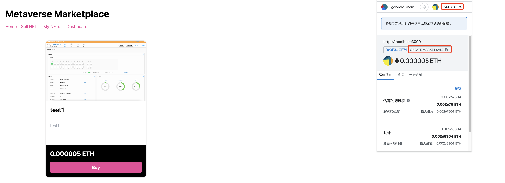
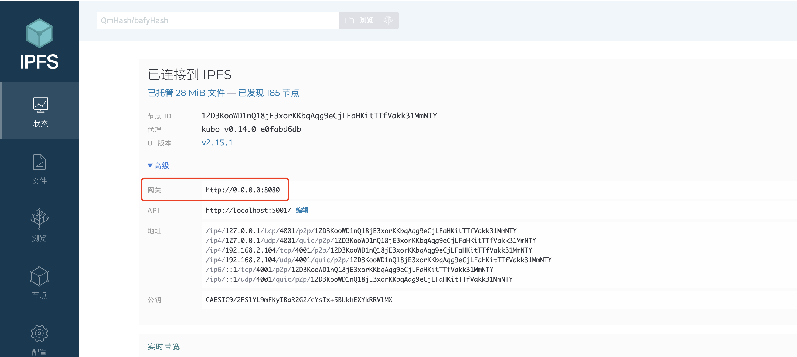

- # 业务流程梳理

## 界面交互

### SellNft/创建nft
<br>
<div align=center>
  </img>
</div>  

调用的合约是`createToken(string memory tokenURI, uint256 price)`  
> Mints a token and lists it in the marketplace  

<br>
<div align=center>
  </img>
</div>  

### Home
<br>
<div align=center>
  </img>
</div>  

### MyNft
<br>
<div align=center>
  </img>
</div>  

自己的nft可以重新标价，买给市场  

<br>
<div align=center>
  </img>
</div>  

## 合约
### 费用消耗
  
`accounts[1]`创建商品前  
```sh
> eth.getBalance(eth.accounts[0])
99665223000000000000
> eth.getBalance(eth.accounts[1])
100913137572000000000
> eth.getBalance(eth.accounts[2])
97968149900000000000

创建后
> eth.getBalance(eth.accounts[1])
100883320532000000000
```

其中gas费用是`0.025 ETH` + `0.00490104 ETH` = `0.02990104 ETH`
交易后的区块信息`BLOCK 43`
```sh
GAS USED 240852
GAS LIMIT 6721975
MINED ON 2022-12-06 23:28:13
BLOCK HASH 0xffcdbfb870860087dad6e974406328c1e1da7e6e33e44164696d8e6c1f9fd2a0
TX HASH 0xf1e3677da01f50dff3fbce84adfa18bbd661da7547f0edc9f7646873af7df11e
CONTRACT CALL
FROM ADDRESS 0xB706B16ad007c8421FE81a05CB8cd2d832A574FF
TO CONTRACT ADDRESS 0xfB339e8c62f7981758168eff65F67eD419163DA3
GAS USED 240852
VALUE 25000000000000000
```

创建商品后
```sh
> eth.getBalance(eth.accounts[1])
100913137572000000000
```
`100913137572000000000 - 100883320532000000000 = 0.02981704`

中间剩余`0.02990104 -  0.025 = 0.00490104`  

=====

`accounts[2]` 购买`10 ETH`  
```sh
> eth.getBalance(eth.accounts[0])
99665223000000000000
> eth.getBalance(eth.accounts[1])
100883320532000000000
> eth.getBalance(eth.accounts[2])
97968149900000000000

交易后的信息
> eth.getBalance(eth.accounts[0])
99690223000000000000     => + 0.025 ETH
> eth.getBalance(eth.accounts[1])
110883320532000000000    => + 10 ETH   seller
> eth.getBalance(eth.accounts[2])
87966416840000000000     => - 1.000173306 ETH  buyer
```

燃料费`0.00207804ETH`  商品费`10 ETH`  , 最大金额:`10.00207804 ETH`   

交易后的区块信息`BLOCK 44`
```sh
GAS USED 86653
GAS LIMIT 6721975
MINED ON 2022-12-07 09:35:53
BLOCK HASH 0x140a5b18a04429de22c9ebd03ee56263703174dc6792d3a844b26e05b37c056d
TX HASH 0x8de122d159c316ed1e36d459766a1dee80d90346b69eb676944ff19c4e4f4481
CONTRACT CALL
FROM ADDRESS 0x620aa582E1Ef6D9a56eaCddB5Aaa28736B1CD92f
TO CONTRACT ADDRESS 0xfB339e8c62f7981758168eff65F67eD419163DA3
GAS USED 86653
VALUE 10000000000000000000
```

>  以太坊矿工费是指成功进行以太坊交易所需的价格或费用的价值。  


矿工费价格估算：  
在某一特定时间点的实际矿工费价值取决于ETH矿工与其用户之间的供求关系。用户是在矿工赚钱的同时承担成本的人。

以太坊仍然采用工作量证明`（PoW）`共识协议，保证矿工验证交易的收益。

不过，如果当前的矿工费未达到最低限额，则矿工可能会集体拒绝处理交易。该阈值的决定因素是Gas限额。这指的是一个人在特定交易中愿意使用的最大计算量。如果Gas限值很高，则预计在执行交易期间将做更多的工作。  

　　Gas限制是由交易发起者设定的，显示了他们愿意购买以完成交易的最大Gas单位数量。    

计算方法:  `交易费用=Gas使用量×Gas支付价格（以ETH为单位）`  


### 工作量证明  
[Bitcoin: A Peer-to-Peer Electronic Cash System](https://bitcoin.org/bitcoin.pdf)  
[比特币——一个点对点的电子现金系统(全文翻译)](https://zhuanlan.zhihu.com/p/33137436)   

一个真正的点对点电子现金系统使我们可以直接进行点对点的转账，而无需经过中间的金融机构。数字签名技术解决了一部分问题，但是如果仍然需要通过信任第三方的方式来防止“重复支付”的话，就失去了电子现金所带来的最大的好处。由此，我们提出了一种点对点网络，来解决“重复支付”的问题。这个网络通过将转账记录进行Hash运算的方式打上时间戳并串连起来，建立了一个无法被改变的转账记录账本。通过这种方式建立的记录链条，不仅是一笔笔转账记录的凭据，同时也代表了其背后计算资源的消耗。攻击者只有在拥有超过一半的计算资源的情况下，才有可能篡改此账本。运行该网络只需要最简单的结构，网络中的消息传播尽可能地覆盖到每一个节点。同时，各个节点都可以随时接入或者离开这个网络，在重新接入时，接受最长的那条转账记录链条即可。  

比特币系统是通过工作量证明（ProofofWork，POW）机制完成的。POW就是一份确认`工作端`做过一定量工作的证明。  


POW的主要特征是计算的单向性：  
- `工作端`需要做一定难度的工作得出一个结果；
- `验证方`却很容易通过结果来检查工作端是不是做了相应的工作。

下面，以比特币系统的记账过程为例，说明基于POW的共识`记账`步骤：  

1. 客户端产生新的交易，向全网进行广播要求对交易进行记账；
2. 每一个记账节点一旦收到这个请求，将收到的交易信息纳入一个区块中；
3. 每个记账节点都通过POW过程，尝试在自己的区块中找到一个具有足够难度的工作量证明；
4. 当某个节点找到了一个工作量证明，它就向全网进行`广播`；
5. 当且仅当包含在该区块中的所有交易都是有效的且之前未存在过的，其他节点才认同该区块的有效性；
6. 其他节点标识它们接受该区块，而表示接受的方法则是在跟随该区块的`末尾`，制造新的区块以延长该链条，而将被接受区块的随机`哈希值`视为先于新区块的随机哈希值。
比特币系统中限定区块大小为1MB，每一区块需要6次确认后，区块包含的交易才被确认。

通过上述的记账过程，客户端所要求记录的交易信息被写入了各个记账节点的区块链中，形成了一个`分布式的高概率`的一致账本。  


## 整体流程
<br>
<div align=center>
  </img>
</div>  


## 疑问及拓展
### Fungible and Non-Fungible Tokens
- ERC-20和ERC-721标准的最大区别在于Token之间是否可以互换。基于ERC-20标准开发的Token没有价值的区别，是可以互换的，基于ERC-721标准开发的Token则是独一无二，不可以互换的；
- ERC-20的Token是可以分割的，而ERC-721的Token最小的单位为1，它是不能分割的。比如基于ERC-20发行的1个EOS 可以分成10份，每份0.1个EOS，而基于ERC-721开发的CryptoKitties的一只猫是不能分成几份的。 

```js
contract ERC20 {
    event Transfer(address indexed from, address indexed to, uint256 value);
    event Approval(
        address indexed owner,
        address indexed spender,
        uint256 value
    );

    function totalSupply() public view returns (uint256);  //代币的总数

    function balanceOf(address who) public view returns (uint256);  // 返回该地址拥有的代币数量

    function transfer(address to, uint256 value) public returns (bool);  // 转账

    function allowance(address owner, address spender)  // 
        public
        view
        returns (uint256);

    function transferFrom(
        address from,
        address to,
        uint256 value
    ) public returns (bool);

    function approve(address spender, uint256 value) public returns (bool);
}

```


```js
contract ERC721 {
    event Transfer(
        address indexed _from,
        address indexed _to,
        uint256 _tokenId
    );
    event Approval(
        address indexed _owner,
        address indexed _approved,
        uint256 _tokenId
    );

    function balanceOf(address _owner) public view returns (uint256 _balance);

    function ownerOf(uint256 _tokenId) public view returns (address _owner);

    function transfer(address _to, uint256 _tokenId) public;

    function approve(address _to, uint256 _tokenId) public;

    function takeOwnership(uint256 _tokenId) public;
}

```


### ipfs公共网关504 

如果使用本地的ipfs服务，需要更新`api接口`和`网关地址`  

`QmQquFGctuYFk2VLxQUuo3QynMAdqdqTY974JGhyBZ2iSo:1          GET https://ipfs.io/ipfs/QmQquFGctuYFk2VLxQUuo3QynMAdqdqTY974JGhyBZ2iSo 504`  

`add`只是添加路径，为了添加到合约中`createToken:https://ipfs.io/ipfs/QmZ4t2BbADcmyRZDHoWuF4E4oswMZNeQsCecUAWhzHq5BR`  

```
https://ipfs.io/ipfs/QmZ4t2BbADcmyRZDHoWuF4E4oswMZNeQsCecUAWhzHq5BR
返回值
{"name":"test1","description":"test1","image":"https://ipfs.io/ipfs/QmUffoK7o92C8k58xY4fMHcCN1oZ8DBEZnybkokQxvj65m"}  
```

修改成本地网关: 访问路径就是`网关`+`/ipfs/`+`CID`
<br>
<div align=center>
  </img>
</div>  

访问:`http://localhost:8080/ipfs/QmUffoK7o92C8k58xY4fMHcCN1oZ8DBEZnybkokQxvj65m`->`http://bafybeic6avrz4w3jj5thdqslkaxm5lfcwcavmraayhh3svuwl3znl656ja.ipfs.localhost:8080/`  

### 套利  

StockFeel 股感 定義套利為『同一種商品在不同市場擁有不同價格，投資人利用低買高賣的價差來獲利』也有人說套利就是一種比較不常見但百分之百獲利的交易方式。但我個人認為這樣定義都只說明了部分的套利行為，套利應該是『在不對市場未來做任何預測的情況下，尋找獲利的機會』  

[加密貨幣套利 — 簡介](https://traderbagel.medium.com/%E6%95%B8%E5%AD%97%E8%B2%A8%E5%B9%A3%E5%A5%97%E5%88%A9%E5%85%A5%E9%96%80%E7%B3%BB%E5%88%97-e48d32ce64e)  


